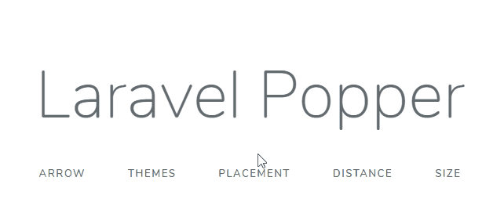

# Laravel Popper

This package provides an easy way to add tooltips in your Laravel blade views. Powered by Popper.js and Tippy.js.
With this, you will not lose time getting them done. Install and use, out of the box. 




## Install

First things, first... Use composer to install the package:

```
composer require andcarpi/laravel-popper
```

## Setup

When composer finish his job, add the Service Provider and the facade to your app.config in the config folder:

> Skip this if you use Laravel 5.5 and above.

```
'providers' => [
    // ...
    // List of Service Providers...
    // ...
    andcarpi\Popper\PopperServiceProvider::class,
],

'aliases' => [
    // ...
    // List of Facades Aliases...
    // ...
    'Popper' => andcarpi\Popper\Facades\Popper::class,
],


```

## Usage

To use Popper in your view, you need to inject the assets needed! 
Use ``@include('popper::assets')``  in the views you need tooltips, right before the body closing tag. 
> ps: If you have a Master View, add the assets on it :)

```
   @include('popper::assets')
</body>
```

Now, it's time to use it. To generate a simple tooltip, just use the Popper facade inside any html element.

```
<button {{ Popper::pop('Tooltip!') }}>Click Me!</button
```

### Blade Directive

Another usage example is to use the ``@popper`` blade directive! 

```
<span @popper(Span Tooltip!)> I'm a Span </span>
```

## Configuration

### Custom Tooltip Options 

You can change the Tooltip default options publishing and editing the config file.

```
php artisan vendor:publish --provider="andcarpi\Popper\PopperServiceProvider" --tag=config
```

The file will be placed inside your config folder. 

Each option is self-explanatory, and you can modify the default behavior of all the tooltips you generate.

### Single Tooltip Options

Each tooltip can be customized using functions. They can also be chained!

- Enable Arrows in the tooltip
```
{{ Popper::arrow()->pop('Tooltip with arrow!'); }}
{{ Popper::arrow('round')->pop('Tooltip with a rounded arrow!'); }}
```

- Modify Tooltip Placement
```
{{ Popper::placement('bottom', 'start')->pop('Bottom Tooltip!'); //position, alignment }}
{{ Popper::position('left')->pop('Left Tooltip!'); // top, right, bottom, left }}
{{ Popper::alignment('end')->pop('Tooltip with end alignment!'); // start, center, end }}
```

- Modify Tooltip distance from the element
```
//Use integers!
{{ Popper::distance(50)->pop('Tooltip far away!'); }}
```

- Modify Tooltip size
```
{{ Popper::size('small')->pop('Small tooltip!'); // 'small', 'regular', 'large' }}
```

- Modify Tooltip Triggers (What will make tooltip appear)
```
// 1st param is mouseenter, 2nd is focus, 3rd is click
{{ Popper::trigger(true, true, false)->pop('This tooltip appears onmouseover and onfocus!'); }} 
```

- Modify Tooltip Show and Hide Delay
```
// Use integer values! 
{{ Popper::delay(500,0)->pop('500ms to appear, but vanishes instantly!');  }}
```

- Modify Tooltip Theme
```
// 'light', 'lightborder', 'google', 'translucent', 'success', 'danger', 'warning', 'info'
// For the success, danger, warning, info, you can also use the Helpers (see next info)
// If you are using themes, enable themes at the config file! 
{{ Popper::theme('light')->pop('Light Theming!');  }}
```

- Simple Success, Danger, Warning, Info Popup Helpers
```
{{ Popper::success('Success Message!") }}
{{ Popper::danger('Danger Message!") }}
{{ Popper::warning('Warning Message!") }}
{{ Popper::info('Info Message!") }}
```

- Enable Tooltip Interactivity
```
{{ Popper::interactive()->pop('Select this text!');  }}
```

- Options Chain!
```
{{ Popper::arrow()->size('large')->distance(50)->position('bottom')->pop('Arrow, Large, Far and at Bottom!'); }}
```

##

This package is powered by [Pooper.js](https://popper.js.org/) and [Tippy.js](https://atomiks.github.io/tippyjs/)

## License

Laravel Popper is open-sourced software licensed under the MIT License (MIT). Please see [License File](LICENSE) for more information.

#### Todo

[x] Danger / Warning / Success , etc pops

[] Custom Theming
